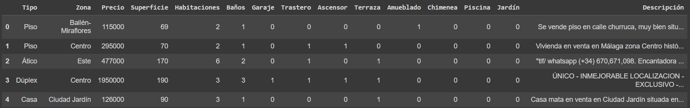
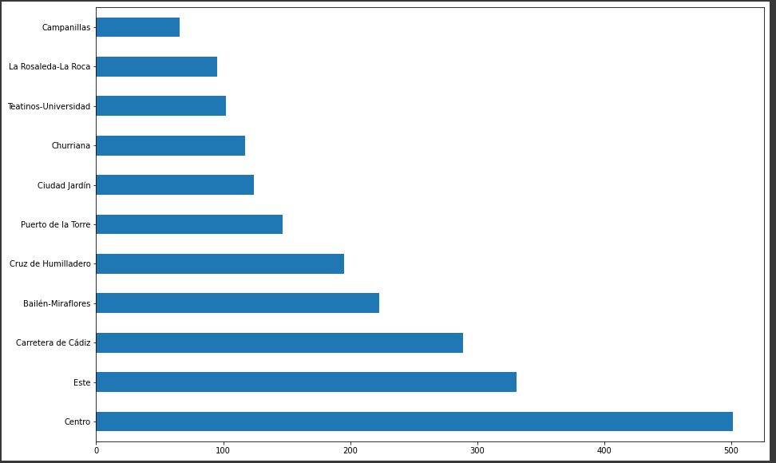
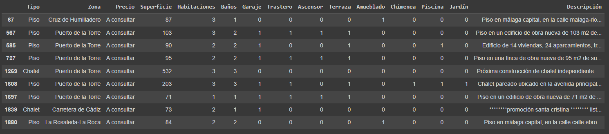
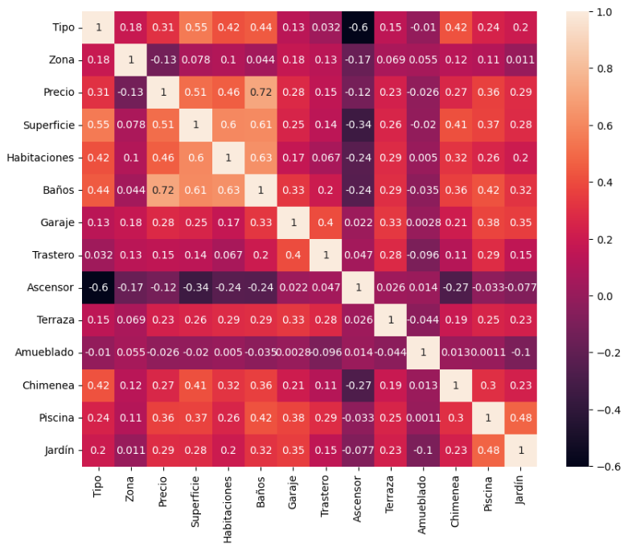
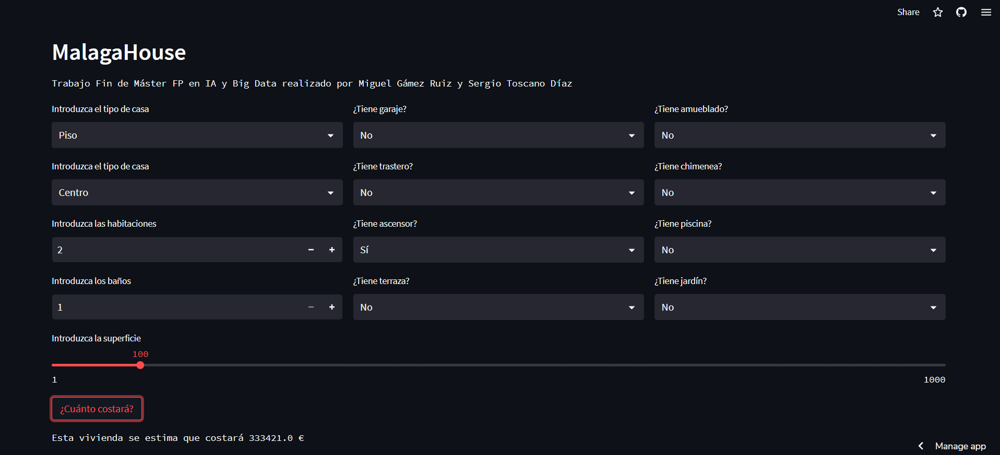

# **MalagaHouse**

## Trabajo Fin de Máster FP en IA y Big Data

*Trabajo realizado por Miguel Gámez Ruiz y Sergio Toscano Díaz*

### Cuaderno MalagaHouse
Ver el cuaderno Jupyter [MalagaHouse](https://github.com/sergiotoscanodiaz/MalagaHouse/blob/main/MalagaHouse.ipynb) si desea visualizar paso a paso el proyecto completo.

### Presentación PDF
Ver la presentación en formato PDF [MalagaHouse](https://github.com/sergiotoscanodiaz/MalagaHouse/blob/main/MALAGAHOUSE.pdf).

### 1. Justificación y descripción del proyecto.

Justificación:

Hemos decidido hacer un proyecto en el que se pueda obtener el precio de las viviendas en Málaga de una forma rápida. Pensamos que puede ser útil para quiénes buscan un lugar para vivir aquí en Málaga. 
De esta manera, el cliente podrá ver qué presupuesto necesitará para comprar o vender según el tipo de vivienda que esté buscando o vendiendo. 
Usamos datos reales para que el cliente tenga una estimación más acertada del precio.

Descripción:

El proyecto de Machine Learning constará de lo siguiente:

- Un modelo entrenado que haga la predicción de las viviendas en Málaga.
- Una aplicación web en la que, en base a los parámetros que se pidan, se obtendrá el precio estimado de las viviendas.
- Enlaces a los recursos utilizados.
- Una presentación PDF y un vídeo explicativo del proyecto.

### 2. Obtención de datos

Usamos Scrapping para obtener los datos de las viviviendas de Málaga Capital.

Ver el cuaderno [ScrappingHousing](https://github.com/sergiotoscanodiaz/MalagaHouse/blob/main/ScrappingHousing.ipynb).

### Descripción de los datos

En el dataset que hemos generado con scrapping tenemos los siguientes campos:

- Tipo: Nombre del tipo de vivienda (Piso, ático, casa).
- Zona: Nombre de la zona de Málaga en la que se encuentra la vivienda.
- Precio: Precio de la vivienda.
- Superficie: Los metros cuadrados que ocupa la superficie de la vivienda.
- Habitaciones: Número de habitaciones que tiene la vivienda.
- Baños: Número de baños que tiene la vivienda.
- Garaje: Si tiene garaje o no. 1 si tiene y 0 si no tiene.
- Trastero: Si tiene garaje o no. 1 si tiene y 0 si no tiene.
- Ascensor: Si tiene ascensor o no. 1 si tiene y 0 si no tiene.
- Terraza: Si tiene terraza o no. 1 si tiene y 0 si no tiene.
- Amueblado: Si tiene amueblado o no. 1 si tiene y 0 si no tiene.
- Chimenea: Si tiene chimenea o no. 1 si tiene y 0 si no tiene.
- Piscina: Si tiene piscina o no. 1 si tiene y 0 si no tiene.
- Jardín: Si tiene jardín o no. 1 si tiene y 0 si no tiene.
- Descripción: Descripción de la vivienda según el vendedor.

### 3. Exploración y visualización de los datos

En este paso exploramos y visualizamos los datos que hemos obtenido:

*En esta imagen se ven algunas filas*

*Una gráfica que muestra cuántas viviendas hay en cada zona*

### 4. Limpieza de datos y Preparación de los datos para los algoritmos de Machine Learning

Lo que realizamos en este paso es una limpieza del dataset para poder prepararlo para los algoritmos de Machine Learning.
Por ejemplo, observamos que la columna *Precio* es de tipo *object*, porque hay varias filas en la que es igual a *"A consultar"*. 

Lo que hacemos es borrarlas para convertirlas en un dato numérico. Para ver cómo se realiza ver el cuaderno Jupyter [MalagaHouse](https://github.com/sergiotoscanodiaz/MalagaHouse/blob/main/MalagaHouse.ipynb).
Además, vemos algunas filas que tienen valores nulos; convertimos las categorías *Zona* y *Tipo* a tipo numérico, ya que los algoritmos trabajan mejor con números; y decidimos eliminar la columna *Descripción*.

Una vez hicimos la limpieza, creamos la matriz de correlaciones entre las categorías.

### 5. Entrenamiento del modelo y comprobación del rendimiento

Para comprobar el rendimiento, usamos varios algoritmos como *LinearRegression*, *RandomForestRegressor*, *GradientBoostingRegressor*, *BayesianRidge*, *CatBoostRegressor* y *XGBRegressor*.

### 6. Aplicación de Procesamiento de Lenguaje Natural

Hemos decidido hacer una aplicación de detección de entidades nombradas.
El objetivo es detectar las localizaciones más relevantes a la hora de buscar vivienda a partir de las descripciones de estas.

### 7. Enlace a la aplicación web

La aplicación se ha realizado con la tecnología Docker en Visual Studio Code y se ha subido al framework Streamlit:
- Visitar [MalagaHouse Streamlit App](https://sergiotoscanodiaz-malagahouse-app-cm5o0s.streamlit.app/) para hacer predicciones de los precios de las viviendas.

### 8. Conclusiones

Tras obtener los datos mediante scrapping, limpiarlos, explorarlos y visualizarlos mediante distintas tablas y gráficas y prepararlos para probar distintos algoritmos, hemos llegado a la conclusión de que con algoritmos como CatBoost y XGBRegressor obtenemos los mejores resultados de rendimiento. Además, hemos realizado un estudio de detección de entidades nombradas con las localizaciones más relevantes. Esto puede ser de utilidad a la hora de buscar vivienda a partir de las descripciones que nos ofrece los datos que hemos obtenido.

### Recursos utilizados:

- Temario de IA, MIA y Big Data.
- https://docs.streamlit.io/
- https://openai.com/blog/chatgpt
- https://www.pisos.com/
- https://youtu.be/D57kiTBFu3I

¡Si te ha gustado el repositorio, nos puedes apoyar dejando una estrella!
